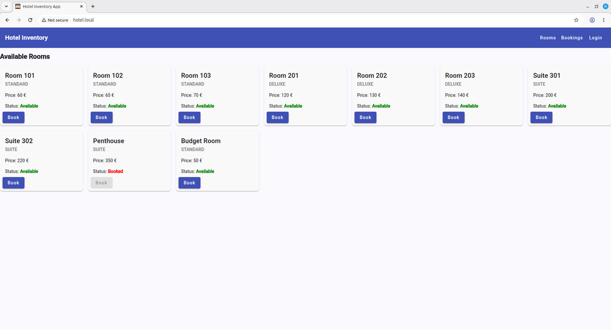
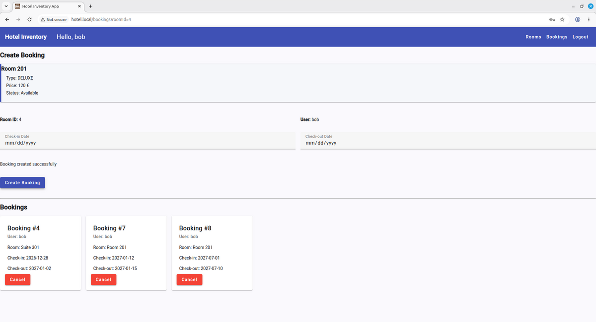
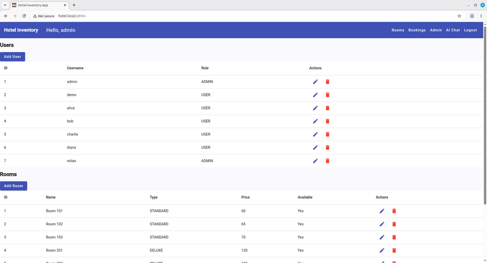
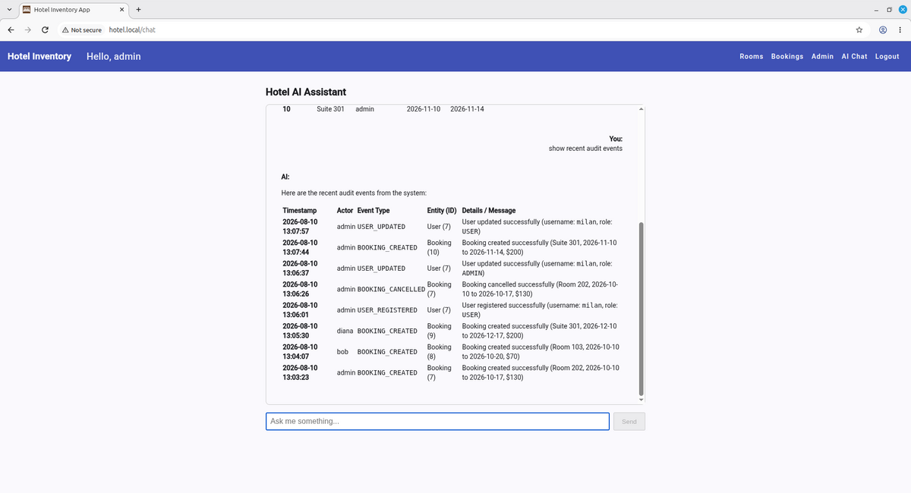

# Hotel Booking Microservices System

A full-stack hotel booking application built using a microservices architecture. The system consists of independent Spring Boot services, an Angular frontend, Spring Cloud Gateway, PostgreSQL databases, Apache Kafka for asynchronous event-driven communication, and an optional AI assistant powered by Spring AI with Ollama or Google Gemini.

## Screenshots

### User Dashboard



### Booking



### Admin Dashboard



### AI Assistant



## Deployment Options

This project can be deployed in three different ways:

- Docker Compose
- Kubernetes Manifests
- Helm Chart

The AI Chat Service is optional and can use either a local Ollama/Qwen3 model or the Google Gemini API and can be enabled for all deployment methods.

## Architecture

### Services

| Service                | Responsibility                                          |
| ---------------------- | ------------------------------------------------------- |
| API Gateway            | Single entry point for frontend requests                |
| User Service           | Authentication, authorization, and user management      |
| Booking Service        | Booking management and business rules                   |
| Audit Service          | Consumes audit events and stores audit logs             |
| Apache Kafka           | Event streaming platform for asynchronous communication |
| AI Chat Service        | AI assistant with access to system data                 |
| Frontend               | Angular web application                                 |
| PostgreSQL             | Persistent data storage                                 |
| AI Provider (Optional) | Ollama (local) or Google Gemini (cloud)                 |

---

## System Architecture

```text
                                  ┌─────────────────┐
                                  │     Browser     │
                                  └────────┬────────┘
                                           │
                                           ▼
                             ┌──────────────────────────┐
                             │ Angular Frontend (Nginx) │  
                             └────────────┬─────────────┘
                                          │
                                          ▼
                           ┌──────────────────────────────┐
                           │         API Gateway          │
                           │     Spring Cloud Gateway     │
                           └─┬────────────┬─────────────┬─┘
                             │            │             │
                             ▼            ▼             ▼
                ┌───────────────┐ ┌───────────────┐ ┌───────────────┐
                │ User Service  │ │Booking Service│ │AI Chat Service│
                └───────┬─┬─────┘ └──────┬─┬──────┘ └─────┬─┬───────┘
                        │ │              │ │              │ │
                        ▼ │              │ ▼              │ ▼
               ┌──────────────┐   ┌────────────┐   ┌────────────────┐
               │userservice_db│   │ booking_db │   │  AI Provider   │
               └──────────────┘   └────────────┘   └────────────────┘
                          │              │                │
                          └──────────────┬────────────────┘
                                         ▼
                                 ┌────────────────┐
                                 │  Apache Kafka  │
                                 │  audit-events  │
                                 └───────┬────────┘
                                         ▼
                                 ┌────────────────┐
                                 │ Audit Service  │
                                 └───────┬────────┘
                                         ▼
                                 ┌────────────────┐
                                 │    audit_db    │
                                 └────────────────┘
```

### Request Flow

```text
Browser
   ↓
Frontend (Angular)
   ↓
API Gateway
   ├── User Service
   ├── Booking Service
   └── AI Chat Service
```

Client requests are routed through the API Gateway using REST APIs.

Internal service-to-service communication uses synchronous REST APIs via Spring Cloud OpenFeign when an immediate response is required. Business events (such as user registration, user updates, and booking creation) are published asynchronously to Apache Kafka, where the Audit Service consumes them and persists audit logs.

---

## Service Responsibilities

### User Service

- JWT authentication
- User management
- Role-based access control
- Admin and User roles

### Booking Service

- Room management
- Booking creation
- Booking cancellation
- Availability checks
- Booking validation rules

### Audit Service

- Consumes audit events from Apache Kafka
- Stores immutable audit logs
- Tracks important business events
- Idempotent event processing
- Passive service without business logic

Examples:

**User events**
- `USER_REGISTERED`
- `USER_UPDATED`
- `USER_DELETED`

**Booking events**
- `BOOKING_CREATED`
- `BOOKING_CANCELLED`

**AI events**
- `AI_REQUEST`
- `AI_RESPONSE`
- `AI_RATE_LIMITED`
- `AI_ERROR`

### AI Chat Service

- Optional AI assistant for administrators
- Built with Spring AI
- Provides read-only access to users, bookings, and audit events
- Protected by a dedicated service-to-service authentication token
- Uses tool calling to retrieve information from backend services
- AI requests are registered by the Audit Service
- Supports two AI providers:
  - Ollama with Qwen3 for local AI processing
  - Google Gemini API for cloud-based AI processing

---

## Architecture Principles

- Separation of concerns
- Independent services
- Clear service boundaries
- API Gateway pattern
- REST for synchronous client requests
- Event-driven communication using Apache Kafka
- AI service is read-only
- AI provider can be switched between Ollama and Google Gemini
- Audit service is passive
- Externalized configuration and credentials
- Service-to-service authentication for AI communication
- Auditable AI service requests

---

## Frontend

Built with Angular and Angular Material.

### Features

- User authentication
- Room browsing
- Booking management
- Admin dashboard
- User administration
- AI chat interface (optional)
- Route guards
- Role-based UI
- JWT authentication

---

## Backend Features

### Authentication

- JWT-based authentication
- Stateless security
- Role-based authorization

### Booking Rules

- No bookings in the past
- Check-out date must be after check-in date
- Maximum booking period validation
- Availability checking

### Audit Logging

- Booking events
- User actions
- System activity tracking

### Event Streaming

- Apache Kafka messaging
- Event-driven architecture
- Asynchronous audit processing
- Kafka producers and consumers
- Consumer groups
- Idempotent event handling

---

## Database Design

The system uses a PostgreSQL instance containing multiple databases:

- userservice_db
- booking_db
- audit_db

Each service owns its own database and is responsible for its own data.

---

## Technology Stack

### Frontend

- Angular
- Angular Material
- TypeScript

### Backend

- Spring Boot
- Spring Security
- Spring Data JPA
- Spring Cloud Gateway
- Spring Cloud OpenFeign
- Spring for Apache Kafka
- JWT Authentication
- Spring AI

### Database

- PostgreSQL

### Messaging

- Apache Kafka

### AI

- Spring AI
- Ollama + Qwen3 (local provider)
- Google Gemini API + Gemini 3.5 Flash (cloud provider)

### DevOps

- Docker
- Docker Compose
- Kubernetes
- Helm
- NGINX Ingress Controller
- Minikube
- Maven
- Git
- GitHub

---

## Continuous Integration

GitHub Actions automatically:

- Runs backend tests and builds
- Runs frontend tests and production build
- Builds Docker images
- Publishes Docker images to GitHub Container Registry
- Tags images with the Git commit SHA

## Getting Started

### Prerequisites

Install the following tools before running the project:

- Java 21
- Maven
- Docker
- Git

For Kubernetes deployments:

- kubectl
- Minikube
- Helm

### Build Backend Services

Before building Docker images or deploying the application, build each Spring Boot service:

```bash
cd user-service && ./mvnw clean package

cd ../booking-service && ./mvnw clean package

cd ../audit-service && ./mvnw clean package

cd ../api-gateway && ./mvnw clean package

cd ../ai-chat-service && ./mvnw clean package
```

Alternatively, if you use an IDE such as IntelliJ IDEA, you can build each service directly from the IDE.

### Deployment

For Kubernetes and Helm deployments, build the Docker images inside Minikube before deploying.

| Deployment                 | Command                                                              |
| -------------------------- | -------------------------------------------------------------------- |
| Docker Compose             | `docker compose up --build`                                          |
| Docker Compose + Ollama    | `docker compose --profile ollama up --build`                         |
| Docker Compose + Gemini    | `docker compose --profile gemini up --build`                         |
| Kubernetes                 | `./scripts/build-images.sh` then `./scripts/deploy-k8s.sh`           |
| Kubernetes + Ollama        | `./scripts/build-images.sh` then `./scripts/deploy-k8s-ollama.sh`    |
| Kubernetes + Gemini        | `./scripts/build-images.sh` then `./scripts/deploy-k8s-gemini.sh`    |
| Helm                       | `./scripts/build-images.sh` then `./scripts/deploy-helm.sh`          |
| Helm + Ollama              | `./scripts/build-images.sh` then `./scripts/deploy-helm.sh --ollama` |
| Helm + Gemini              | `./scripts/build-images.sh` then `./scripts/deploy-helm.sh --gemini` |

#### Cloud Deployment

The current architecture is designed for local deployment using Docker Compose or Kubernetes/Helm. 
A free public cloud deployment is not currently provided because running the complete stack 
(PostgreSQL, Kafka, five Spring Boot services, Angular/Nginx, and the optional AI service) 
requires more resources than typical free-tier hosting provides.

For demonstration purposes, the application can be run locally using Docker Compose or Minikube.

#### Configuration & Security

Sensitive configuration is externalized from the application source code and provided through environment variables. This includes PostgreSQL credentials, the JWT signing secret, the AI service token, and the Gemini API key.

For local development, copy `.env.example` to `.env` and provide your own values. The same `.env` file serves as the configuration source for all three deployment methods. Docker Compose reads the values directly, while the Kubernetes and Helm deployment scripts use them to create or update Kubernetes Secrets.

The AI Chat Service uses a dedicated `AI_SERVICE_TOKEN` for service-to-service authentication between the API Gateway and the AI Chat Service. This separates authenticated AI-service communication from ordinary application traffic.

AI-related requests are registered by the Audit Service, providing an audit trail of AI service usage.

#### Cleanup

| Cleanup                 | Command                     |
| ----------------------- | --------------------------- |
| Kubernetes Manifests    | `./scripts/cleanup.sh k8s`  |
| Helm Chart              | `./scripts/cleanup.sh helm` |
| Both                    | `./scripts/cleanup.sh all`  |

The cleanup script removes Kubernetes resources created by the selected deployment method, including the Gemini Kubernetes Secret. Docker Compose can be stopped with `docker compose down`.

#### Accessing the Application - Docker Compose

| Component   | URL                   |
| ----------- | --------------------- |
| Frontend    | http://localhost:3000 |
| API Gateway | http://localhost:8080 |
| Kafka UI    | http://localhost:8085 |

#### Accessing the Application - Kubernetes / Helm

Enable the NGINX Ingress Controller:

```bash
minikube addons enable ingress
```

Add the Minikube IP to your hosts file:

```text
<MINIKUBE_IP> hotel.local
<MINIKUBE_IP> kafka.hotel.local
```

Replace <MINIKUBE_IP> with the output of:

```bash
minikube ip
```

Application URLs:

| Component   | URL                      |
| ----------- | ------------------------ |
| Frontend    | http://hotel.local       |
| API Gateway | http://hotel.local/api   |
| Kafka UI    | http://kafka.hotel.local |

#### Verify the Deployment

```bash
kubectl get pods
kubectl get ingress
helm list
```

## Configuration

### Environment Variables

See `.env.example` for the full list. Variables added for security and observability:

| Variable                             | Default                              | Description                                                   |
| ------------------------------------ | ------------------------------------ | ------------------------------------------------------------- |
| `ADMIN_USERNAME`                     | `admin`                              | Bootstrap admin created by user-service on startup            |
| `ADMIN_PASSWORD`                     | `admin123` (local dev only)          | Bootstrap admin password; leave empty to skip admin creation  |
| `AUTH_LOCKOUT_MAX_ATTEMPTS`          | `5`                                  | Failed logins per username before a `429` lockout             |
| `AUTH_LOCKOUT_DURATION_MINUTES`      | `15`                                 | Lockout window                                                |
| `JPA_SHOW_SQL`                       | `false`                              | Enables SQL logging (development only)                        |
| `TRACING_ENABLED`                    | `false`                              | Enables OTLP trace export                                     |
| `TRACING_SAMPLING_PROBABILITY`       | `0.1`                                | Trace sampling probability                                    |
| `OTEL_EXPORTER_OTLP_TRACES_ENDPOINT` | `http://localhost:4318/v1/traces`    | OTLP traces endpoint                                          |

In Kubernetes, `ADMIN_USERNAME` and `ADMIN_PASSWORD` are read from the `app-secret` secret.

### Database Migrations

Schemas are managed by Flyway instead of Hibernate DDL generation. Every JPA service runs
with `spring.jpa.hibernate.ddl-auto: validate` and applies the migrations in
`src/main/resources/db/migration` on startup (`V1__init.sql` for the schema, `V2__seed_*.sql`
for demo data). Add new schema changes as a new versioned migration; never edit an applied one.

### Actuator Endpoints

Every backend service exposes `health`, `info` and `prometheus`:

```text
/actuator/health
/actuator/health/liveness
/actuator/health/readiness
/actuator/info
/actuator/prometheus
```

The liveness/readiness endpoints back the Kubernetes and Helm probes, and Prometheus can scrape
`/actuator/prometheus`. Distributed tracing (Micrometer Tracing + OTLP) is enabled with
`TRACING_ENABLED=true`.

### Pagination

`GET /api/users` and `GET /api/bookings` are paginated and accept `page`, `size` and `sort`
request parameters, returning `{ content, page, size, totalElements, totalPages, last }`.

## Default Credentials

### Administrator

The bootstrap admin is created from `ADMIN_USERNAME` / `ADMIN_PASSWORD`. With the local-dev
defaults these are:

Username:

```text
admin
```

Password:

```text
admin123
```

Set both variables to real values outside local development.

### Sample Users

All users loaded from the seed migration:

Password:

```text
password
```

---

## Key Concepts Demonstrated

- Microservices architecture
- API Gateway pattern (Spring Cloud Gateway)
- Database-per-service design
- RESTful APIs
- Synchronous service-to-service communication with Spring Cloud OpenFeign
- Event-driven architecture with Apache Kafka
- Asynchronous messaging
- Kafka producers and consumers
- Consumer groups
- Idempotent event processing
- JWT authentication and authorization
- Role-based access control (RBAC)
- Docker containerization
- Optional AI integration with Spring AI
- AI provider integration with Ollama/Qwen3 or Google Gemini
- AI tool calling for accessing backend data
- Read-only AI access to business data
- Kubernetes Deployments
- StatefulSets
- ConfigMaps
- Secrets
- Kubernetes Services
- Persistent Volumes
- Kubernetes Jobs
- NGINX Ingress
- Helm charts
- Infrastructure as Code with Kubernetes manifests and Helm

